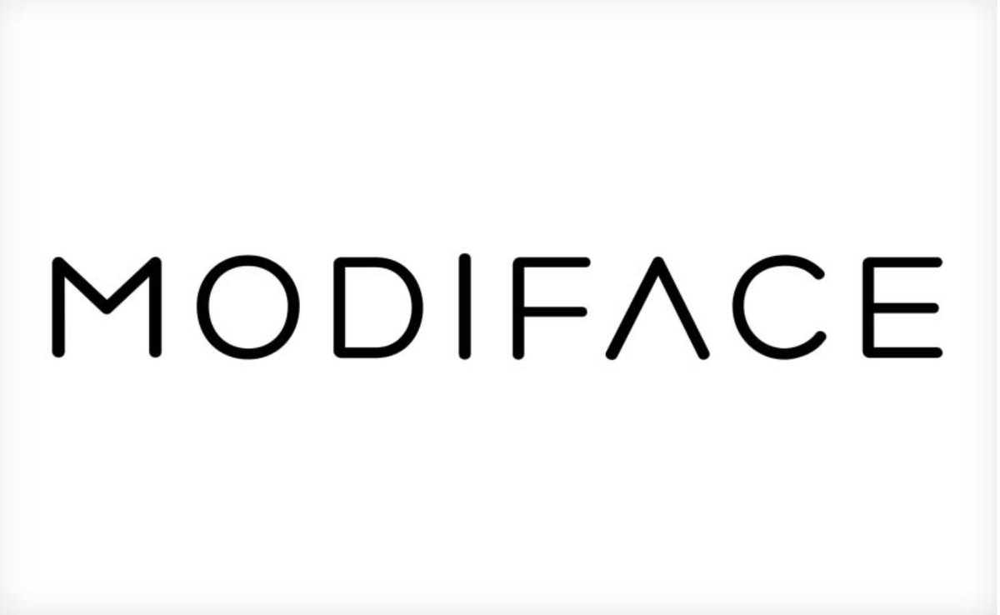

# Deep Graphics Encoder for Real-Time Video Makeup Synthesis from Example

    <h2><a style="width: 10%;margin: 2.5%;" href="https://www.linkedin.com/in/robin-kips" target="_blank">Robin Kips</a><a style="width: 10%;margin: 2.5%;" href="https://www.linkedin.com/in/ruowei-irene-jiang-a1743576/" target="_blank">Ruowei Jiang</a><a style="width: 10%;margin: 2.5%;" href="https://www.linkedin.com/in/sileyeba/" target="_blank">Sileye Ba</a><a style="width: 10%;margin: 2.5%;" href="https://www.linkedin.com/in/edmundp/" target="_blank">Edmund Phung</a><a style="width: 10%;margin: 2.5%;" href="https://www.linkedin.com/in/parhamaarabi/" target="_blank">Parham Aarabi</a><a style="width: 10%;margin: 2.5%;"   href="https://www.linkedin.com/in/pietro-gori-b097bb118/" target="_blank">Pietro Gori</a><a style="width: 10%;margin: 2.5%;" href="https://www.linkedin.com/in/matthieu-perrot-225ab01b/" target="_blank">Matthieu Perrot</a><a style="width: 10%;margin: 2.5%;" href="https://www.linkedin.com/in/isabelle-bloch-b954144/" target="_blank">Isabelle Bloch</a></h2>

         

	

<!--
.png)
-->

Examples of lipstick transfer from example images usingour proposed method

### Abstract:
While makeup virtual-try-on is now widespread, parametrizing a computer graphics rendering engine for synthesizing images of a given cosmetics product remains a challenging task.
In this paper, we introduce an inverse computer graphics method for automatic makeup synthesis from a reference image, by learning a model that maps an example portrait image with makeup to the space of rendering parameters. 
This method can be used by artists to automatically create realistic virtual cosmetics image samples, or by consumers, to virtually try-on a makeup extracted from their favourite reference image.

### Video examples:

<iframe  style="display: block; margin: auto;" width="560" height="315" src="https://www.youtube.com/embed/GmciY9rUMOw" frameborder="0" allow="accelerometer; autoplay; encrypted-media; gyroscope; picture-in-picture" allowfullscreen></iframe>
<iframe style="display: block; margin: auto;"  width="560" height="315" src="https://www.youtube.com/embed/0dMrf0yZvUw" frameborder="0" allow="accelerometer; autoplay; encrypted-media; gyroscope; picture-in-picture" allowfullscreen></iframe>

### Paper:

Paper : [CVPR Workshop proceedings (TBD)](tbd.com) \
ArXiv : [https://arxiv.org/pdf/2105.06407.pdf](https://arxiv.org/pdf/2105.06407.pdf) \
Supplementary Materials : [CVPR Workshop supplementary (TBD)](tbd.com)
<!--
 

    
    
        
    

    

        

            R. Kips, R. Jiang, S. Ba, A. Phung, P. Aarabi, P. Gori, M. Perrot, I.Bloch 
            
                <b>Deep Graphics Encoder for Real-Time Video Makeup Synthesis from Example</b>
            
             
            AIM20 (ECCV20 Workshop)
            <a href="https://arxiv.org/abs/2008.10298" target="_blank">[arXiv]</a>&nbsp;<a href="bibtex.txt" target="_blank">[BibTeX]</a>&nbsp;<a href="ca_gan_supplementary.pdf" target="_blank">[Supplementary Materials]</a>
        

    

-->

### Model Architecture:
Left:  training procedure of our model.  We sample a graphics parameters vectorgiand render a corresponding image using a renderer *R* and a random source image *X_i*.  Then, the inverse graphics encoder *E* is trained to map the image to the space of graphics parameters with minimum error. Right: inference pipeline. A reference image *X_ref* is passed to the inverse graphics encoder to estimate the corresponding makeup graphics parameters. Then this code can be used as input to the rendering engine, to render the reference makeup on videos in real-time. To facilitate training and increase the proportion of relevant pixels in the image, *E* is trained on crops of eyes and lips.

<!--  -->

	

### Results:

Lipstick synthesis from example image
.png)

Eye shadow synthesis from example image
.png)

Below, a qualitative comparison on lipstick and eye-shadow synthesis against state of the art makeup transfer methods. Our method is capable of reproducing realistic rendering in high resolution for makeup with various colors and textures. The eye-shadow application zone and intensity are not part of the estimated graphics parameters, but set by the user at rendering time according to their preferences.
.png)
